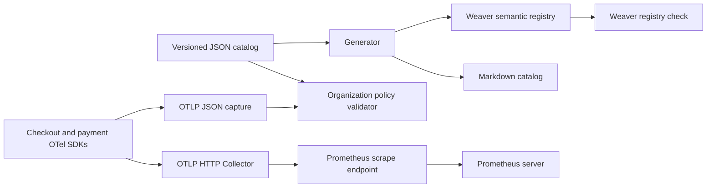

# Architecture and governance guide

## 1. What this POC demonstrates

Metrics governance answers four questions: what does this measurement mean, who owns it, which dimensions are safe, and what changes may break consumers? This repository makes those decisions reviewable in Git and automatically validates the parts that software can check.

A passing build establishes agreement between the declared contract and the exercised instrumentation. It does not prove that all production paths were exercised or that a business definition is correct. Human review still matters.

## 2. Data flow



There are two execution modes. The fast local/CI mode collects SDK metrics in memory and encodes them with the official OTLP protobuf encoder. The Compose mode exports the same SDK data over OTLP HTTP to the Collector, which exposes Prometheus metrics for scraping.

The demo services are separate OTel resources in a single Python process. This keeps the lab small while preserving distinct service identities. In production, instantiate one provider per real process and use normal periodic export.

## 3. Contract and source of truth

`catalog/metrics.json` is authoritative. Each metric declares:

| Field | Meaning |
|---|---|
| `name` | Stable OTel instrument name in the custom `demo` namespace |
| `instrument` | Counter or histogram |
| `unit` | Exact semantic unit, not a display label |
| `description` | What is counted or observed |
| `owner` | Responsible team; `demo-platform` is a lab placeholder |
| `stability` | Current stability declaration |
| `attributes` | Required dimension keys and finite allowed values |
| `max_attribute_combinations` | Upper bound on the dimension domain product per resource |
| `deprecation_policy` | Required migration notice and overlap period |

Required resource attributes are `service.name`, `service.version`, and `deployment.environment.name`. Ownership stays in the catalog; it does not need to become a label on every sample.

The generator produces a Weaver registry and readable catalog. `--check` compares generated content byte-for-byte so CI detects stale documentation or registry files. Never edit generated files directly.

All five metrics are custom business-operation metrics. They do not claim to implement the HTTP semantic conventions. When adding actual HTTP instrumentation, reuse the upstream `http.server.request.duration` definition and its attributes instead of inventing a competing HTTP standard. This lab avoids a remote registry dependency; pin an upstream semantic-conventions release when introducing one.

## 4. Metric meanings

An operation is a completed synthetic checkout or payment attempt. Every attempt increments `demo.operation.count` and observes `demo.operation.duration`. A failed attempt also increments `demo.operation.errors`. Successful attempts increment `demo.order.count` and observe `demo.order.value` in USD.

The order metrics are demonstrative service-local counts, not a cross-service deduplicated business KPI. Summing checkout and payment order counters would double-count the simulated business flow. The failure ratio denominator includes successful and failed completed operations. In-flight attempts are excluded.

Duration uses seconds measured conceptually across the whole operation. The simulator provides deterministic values from 0.05 to 0.24 seconds rather than timing real requests. Order value is 19.99 USD per successful event; multi-currency aggregation is outside this contract.

## 5. Validation layers

1. **Organization catalog checks:** require ownership, descriptions, deprecation policy, supported instruments and units, unique names, bounded attribute domains, and a sufficient combination budget.
2. **Generated artifact checks:** prevent divergence between JSON, Weaver YAML, and Markdown.
3. **Weaver registry checks:** validate semantic convention structure and built-in registry policies.
4. **SDK telemetry checks:** compare actual exported metric names, units, types, cumulative temporality, monotonic counters, dimensions and values, required resources, nonempty points, and per-service metric coverage.
5. **Adversarial tests:** prove that intentionally wrong units, unapproved attributes, empty telemetry, missing metrics/resources, and unknown metrics are rejected.

Weaver validates the registry and adapted metric samples in the required CI path. The Python validator supplies the strict organization-specific telemetry gate. Do not assume Weaver live-check alone enforces all local policies or returns a failing exit status for every advisory finding. The live-check exercise and format adapter are documented in the labs.

The validator is deliberately scoped to this metric-only lab: counters and explicit histograms, cumulative temporality, and required presence of all five metrics per captured service. Event-driven production metrics may require workload-specific coverage expectations. It does not validate numerical business invariants, all protobuf invariants, or every OpenTelemetry signal type.

## 6. Cardinality policy

Two allowed values for operation and two for outcome yield at most four attribute combinations per metric per resource. The catalog checker rejects a domain product above the declared budget. This is a design-time bound, not a live Prometheus series count.

Histograms produce multiple series per dimension combination (buckets, sum, count). Service instances, other resource labels, and Collector-added metadata multiply series further. Do not interpret a budget of four as four total stored time series.

The synthetic `demo.customer_id` violation illustrates why unbounded dimensions should not be ordinary metric labels. Use trace/log context for individual identifiers where appropriate. For a later production exercise, configure SDK Views before aggregation to retain approved dimensions and add live series monitoring; this repository detects violations but does not silently drop dimensions.

## 7. Prometheus naming and resource handling

OTel names keep dots and units in metadata. The pinned Collector exporter explicitly uses `UnderscoreEscapingWithSuffixes` to normalize names and append unit/type suffixes. For example, `demo.operation.count` becomes `demo_operation_count_total`, and the duration histogram is exposed under `demo_operation_duration_seconds` with classic histogram suffixes.

The Collector copies only `service.name` into datapoint labels (`service_name` after translation). This post-capture infrastructure label is intentionally separate from application-owned dimensions. Automatic promotion of all resources is disabled. The Prometheus scrape target also contributes scrape labels.

Useful queries after the demo has run for at least a minute:

```promql
sum by (service_name) (demo_operation_count_total)

sum by (service_name) (rate(demo_operation_errors_total[1m]))
/
sum by (service_name) (rate(demo_operation_count_total[1m]))

histogram_quantile(0.95,
  sum by (service_name, le) (rate(demo_operation_duration_seconds_bucket[1m]))
)
```

The expected error ratio is approximately 0.2. The p95 is a bucket-based estimate. Query the raw `/metrics` endpoint when diagnosing name translation. Pin and integration-test exporter upgrades before changing names relied on by dashboards.

## 8. Change and ownership workflow

Replace the placeholder owner with a real accountable team before adoption. For each proposed metric change, the owner reviews meaning, dimensions, cardinality, consumer impact, and migration steps.

1. Edit the catalog and increment its semantic version.
2. Update instrumentation separately, preserving the ability to detect drift.
3. Run `python -m governance.generate`.
4. Run local checks and tests; review the generated diff.
5. Submit the change for review and inspect CI artifacts.
6. For renames or changed meanings/units, introduce a replacement metric, support both for at least 30 days, migrate consumers, and remove the old metric only after review.

Suggested versioning policy: patch for wording with unchanged meaning, minor for compatible additions, major for incompatible meaning/type/unit/dimension changes. This workflow is documented policy; automatic baseline compatibility comparison and calendar-based deprecation enforcement are not implemented.

CI runs on pushes and pull requests with read-only repository permissions. It does not by itself prevent merges: configure a repository ruleset requiring the `governance` job after the first successful run. Add CODEOWNERS using real GitHub users/teams if required. The POC does not modify account-level policies or branch protections.

## 9. Operations and troubleshooting

- **Import failures:** activate the virtual environment and install requirements from the repository root.
- **Wrong working directory:** module commands expect `catalog/` relative to the current directory.
- **Stale generated file:** run the generator and commit both generated outputs.
- **Weaver install:** the helper supports Linux x86_64 and Apple Silicon. Install the pinned official release manually for another platform.
- **Connection refused on OTLP:** start the Collector first; the Compose demo restarts on failure. The full HTTP endpoint must end with `/v1/metrics`.
- **No Prometheus samples:** check `docker compose logs collector demo`, inspect port 8889, then Prometheus targets. Allow for batching and scrape delay.
- **Port conflicts:** change only the host side of the loopback port mappings. Container-to-container targets remain unchanged.
- **No rate result:** allow multiple scrapes and a full query window; use a raw counter query first.
- **Cleanup:** `docker compose down` removes containers and the network. No persistent data volume is configured.

This is a local learning environment. Before shared deployment, add authentication, TLS, resource limits, persistence/retention decisions, image digest pinning, and tested upgrade procedures appropriate to your environment.

## 10. References

- [OpenTelemetry semantic conventions](https://opentelemetry.io/docs/specs/semconv/)
- [OTel metric naming and units](https://opentelemetry.io/docs/specs/semconv/general/metrics/)
- [OpenTelemetry Weaver](https://github.com/open-telemetry/weaver)
- [Pinned Collector Prometheus exporter](https://github.com/open-telemetry/opentelemetry-collector-contrib/blob/v0.135.0/exporter/prometheusexporter/README.md)
- [Prometheus naming guidance](https://prometheus.io/docs/practices/naming/)
- [Prometheus instrumentation guidance](https://prometheus.io/docs/practices/instrumentation/)
